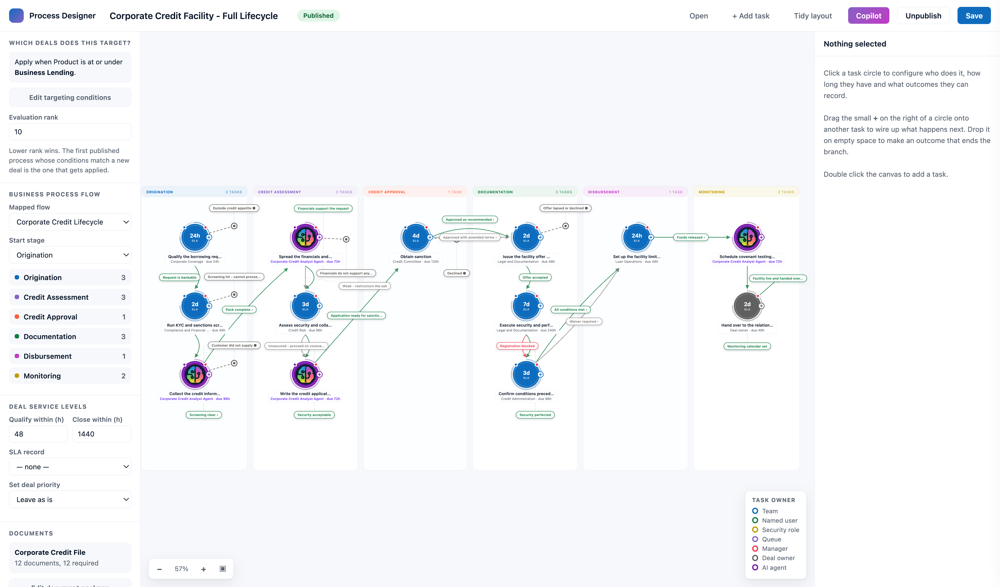
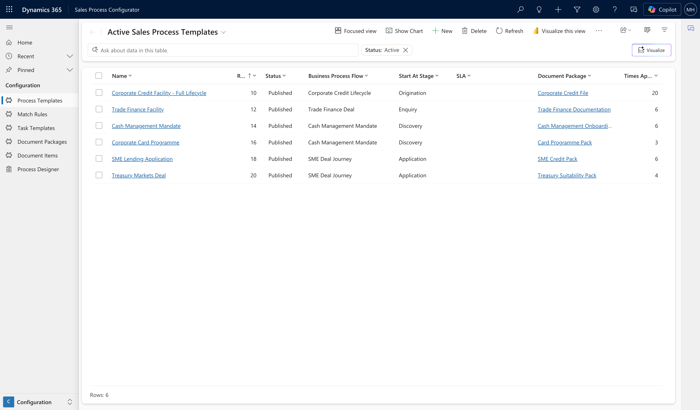
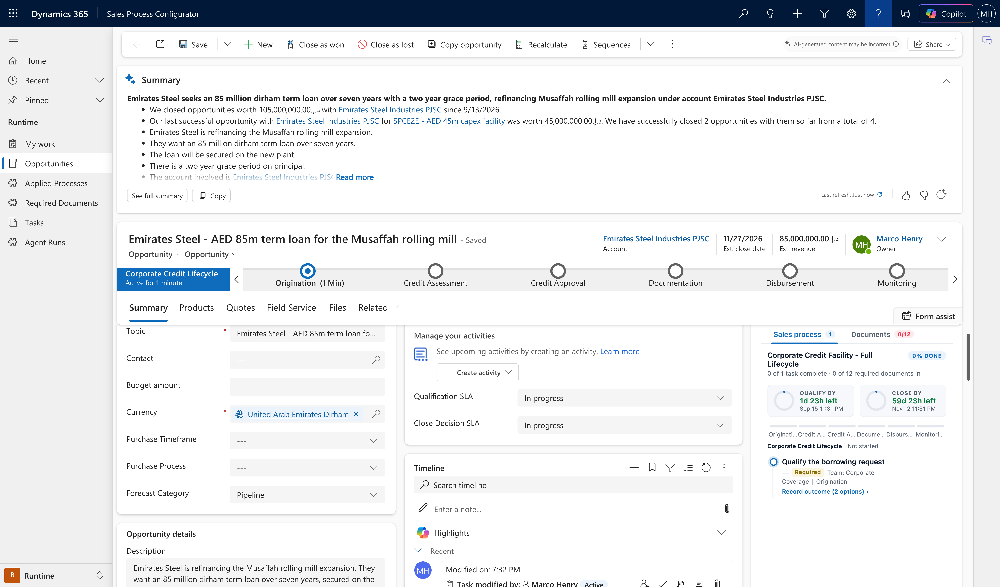
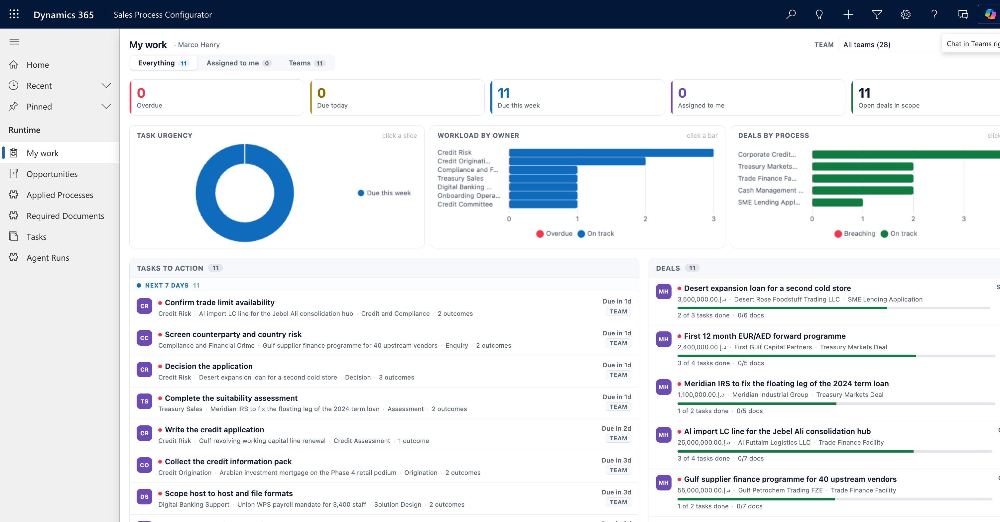
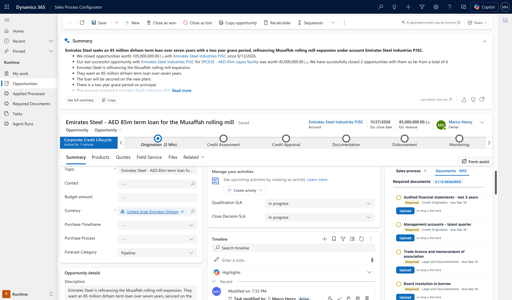
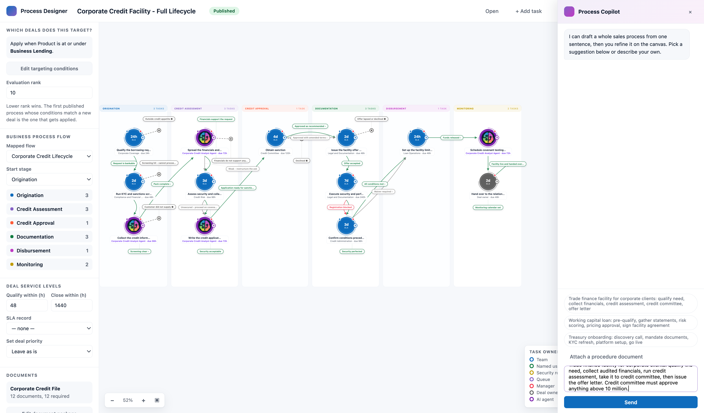

# Sales Process Configurator

**A declarative, business-user-configurable deal handling accelerator for Microsoft Dynamics 365 Sales and Dataverse.**

> [!WARNING]
> **This is a demonstration accelerator. It is not built, reviewed or tested for production use, and is provided "as is" with no warranty and no support. Use entirely at your own risk.** Deploy only to a disposable trial, developer or sandbox environment — never to production, and never to an environment holding real personal, regulated or business-critical data. Please read the full [DISCLAIMER](DISCLAIMER.md) before installing.

---

## The problem

Most sales processes exist twice. There is the one written down — the playbook, the credit
procedure, the deal desk checklist — and there is the one the CRM actually enforces, which is
usually just a business process flow with some required fields.

Everything that makes the process real lives outside the system: which steps apply to *this* kind
of deal, who has to do them, in what order, what has to be collected before the deal can advance,
and what happens when a step comes back "declined" instead of "approved". That knowledge sits in
people's heads and in documents, and when it changes, someone raises a change request.

## What this accelerator does

It moves the entire deal handling process into **configuration data that a business user owns**.

A **Sales Process Template** answers two questions:

1. **Which deals does this apply to?** — match rules evaluated against the opportunity, driven
   primarily by the **product lines on the deal**, along with value thresholds, customer segment,
   sales stage and other fields.
2. **What happens to those deals?** — applied automatically the moment the opportunity is created:
   - the **clocks** — qualification and close targets,
   - the **Business Process Flow** to run, and which stage to start in,
   - an **outcome-driven task graph** — the tasks to create, in what order, owned by which team,
     user or AI agent, each with its own due target,
   - the **document packages** that must be collected before the deal can progress.

The distinguishing idea is the **outcome-driven task graph**. A task is not a checklist item — it
publishes a set of possible outcomes ("Approved", "Declined", "Refer to committee", "More
information needed"). When a seller records an outcome, the engine decides what happens next:
which task to create, who owns it, whether to advance the business process flow stage, whether to
request further documents. The same starting deal can follow completely different paths depending
on what actually happens — and every one of those paths is configuration, not code.

---

## Relationship to the Case Process Configurator

This is a sibling of the [**Case Process Configurator**](https://github.com/erturkm/case-process-configurator),
which applies the same idea to service cases.

The two are **completely isolated**. They share no tables, no plug-in assembly, no custom APIs, no
web resources and no app. Every component here is `spc_` prefixed; every component there is `cpc_`
prefixed. You can install either one on its own, or both side by side in the same environment.

The meaningful difference is what drives targeting:

| | Case Process Configurator | Sales Process Configurator |
|---|---|---|
| Target table | Case | Opportunity |
| Targeting driven by | Case subject tree | Product lines on the deal |
| Clocks | First response, resolution | Qualification, close |
| Runtime home | Case form | Opportunity form |

---

## Main capabilities

### Configuration — owned by the business



| Capability | What it gives you |
|---|---|
| **Sales process templates** | A single record defining targeting plus everything applied at runtime. Versioned, activatable, and orderable by priority when several could match. |
| **Match rule builder** | Compose targeting conditions over the opportunity — product lines, estimated value, customer segment, sales stage — with AND/OR grouping. Test rules against real deals before activating. |
| **Product-line targeting** | Rules resolve against the products actually on the deal, so a template applies because of what is being sold, not because someone picked it from a list. |
| **Visual process designer** | Drag-and-drop authoring of the outcome-driven task graph, with inline due targets, labelled outcome connectors and elastic swimlanes per business process flow stage. |
| **Copilot process authoring** | Describe a process in natural language, or upload a written procedure, and have the template, tasks, outcomes, owners, targets and document requirements generated for you. |
| **Task outcomes** | Each task publishes its own outcome set. Outcomes drive branching, so one template can express many real-world deal paths. |
| **Per-task assignment** | Route each task to a specific team, a named user, the deal owner, the owner's manager, or an AI agent. |
| **Per-task due targets** | Each task carries its own target, independent of the deal-level clocks. |
| **Document packages** | Reusable bundles of required deal documents with mandatory flags, sequence and due offsets. |
| **Business process flow binding** | Bind a template to a sales BPF and a starting stage; stages advance automatically as outcomes are recorded. |

### Runtime — automatic on opportunity creation



| Capability | What it gives you |
|---|---|
| **Automatic template matching** | On create, the engine evaluates active templates in priority order and applies the first match. No manual selection. |
| **Clock stamping** | Qualification and close targets written to the deal from the template, with status maintained as they approach and pass. |
| **BPF application** | The bound business process flow is instantiated and set to the configured starting stage. |
| **Outcome-driven task creation** | The initial tasks are created with owners and targets. Recording an outcome creates the next task in the graph. |
| **Document requirement generation** | Required document records created from the template's document packages. |
| **Deal rollups** | Open/total task counts, received/total document counts and progress maintained on the opportunity for views and dashboards. |

### Seller experience



| Capability | What it gives you |
|---|---|
| **Tabbed deal panel** | One space-efficient panel on the opportunity form with tabs for the sales process and required documents, each showing a live count badge that turns red on overdue or outstanding mandatory items. |
| **Deal clock** | Two live dials on the deal showing time remaining to the qualification and close targets, colour-coded as they near and pass breach. |
| **Outcome picker** | Record a task outcome from the deal, driving the process forward. |
| **My work dashboard** | Personal and team pipeline workload in one view, with a team picker and a mine/team/everything scope switch. |
| **Interactive charts** | Task urgency, workload by owner and deals by product line — all clickable and cross-filtering, with removable filter chips. |



### AI agents as process participants



A task in the graph can be owned by an **AI agent** instead of a person or a team. The agent is a
first-class participant in the same outcome-driven process — it receives the same context, records
one of the same published outcomes, and advances the same graph.

| Capability | What it gives you |
|---|---|
| **Agent-assigned tasks** | Assign any task to an AI agent, configured declaratively alongside human tasks — no separate orchestration layer. |
| **Scoped context** | Choose exactly what the agent may see: deal fields, deal narrative, product lines, customer profile, other deals with the customer, notes, emails, prior task outcomes, required documents and clock status. |
| **Outcome modes** | The agent either selects one of the task's published outcomes, or proposes one for a human to confirm. |
| **Confidence threshold and autonomy** | Set the confidence required before an agent may complete a task unattended; below it, the task is handed to a person. |
| **Human authority preserved** | Credit decisions, pricing approvals, security waivers and anything customer-facing stay human by design. The agent prepares; a person decides. |

### Process authoring from a written procedure



| Capability | What it gives you |
|---|---|
| **Upload a procedure** | Give the designer Copilot a real sales or credit procedure as a Word document and it designs the process from it. |
| **Grounded in your environment** | The design is generated against what actually exists — your business process flows, teams, document packages and AI agents — not invented names. |
| **Stated assumptions** | Every inference, gap and mapping decision is surfaced explicitly rather than hidden, so a reviewer can see what the model had to assume. |
| **Preview before commit** | The authored process is validated against the environment and previewed before anything is written. |

### Technical

- **Custom Dataverse tables** — templates, match rules, process tasks, task outcomes, document packages, document items, applied processes and deal required documents, all `spc_` prefixed.
- **Custom APIs** — `GetOpportunityView`, `GetProcessGraph`, `SaveProcessGraph`, `GetProcessCatalog`, `TestMatchRules`, `AuthorProcess`, `DesignProcess`, `BuildOpportunityContext`, `PrepareAgentTask`, `GetAgentCatalog`, `CompleteAgentTask`.
- **Sandboxed C# plug-in assembly** — the process engine, running in the supported sandbox isolation mode.
- **Model-driven app** with configuration, runtime and setup areas.
- **Web resources** — visual designer, deal process widget, required documents widget, tabbed deal panel, outcome picker, workload dashboard.
- **Chart.js bundled as a web resource**, not loaded from a CDN, so the dashboard works in locked-down tenants with restricted script origins.
- **No secrets in the solution** — the Azure AI Foundry connection is held in Dataverse environment variables whose *values* are deliberately excluded from the exported solution, so no credential can ever travel in a solution zip.
- **Idempotent Python build scripts** — every step can be re-run safely, so the whole solution can be rebuilt from source against a fresh environment.

---

## A note on the deal clock

The Case Process Configurator puts the supported **Modern SLA Timer** control on the case form.
That is not possible here: the Dataverse `opportunity` table has `IsSLAEnabled = false`, so it
cannot hold SLA KPI instances, and the flag is not settable on a system table through the Web API.

Rather than enable SLA on a system table tenant-wide for a cosmetic control, this accelerator draws
its own **deal clock** from the engine's own qualification and close columns. It shows the same
information — time remaining, target time, and a colour-coded state — computed by the same engine
that stamps the targets.

---

## Installation

Two options — import the solution, or build it from source.

**See [INSTALL.md](INSTALL.md) for full step-by-step instructions**, including prerequisites,
post-import configuration, sample data, verification and uninstall.

Quick summary:

```bash
# Option A — import the packaged solution (fastest)
#   Power Platform admin centre -> Solutions -> Import
#   -> solution/SalesProcessConfigurator_1_0_0_0_managed.zip
#   Then run the post-import steps in INSTALL.md.

# Option B — build from source against your own environment
az login
export DATAVERSE_URL="https://yourorg.crm.dynamics.com"
cd src
python3 step1_solution.py && python3 step2_tables.py   # ... see INSTALL.md
```

> [!IMPORTANT]
> Installing modifies your environment. It creates tables, registers a plug-in assembly and custom
> APIs, and **edits shared artefacts** — the Opportunity main form, the model-driven app site map,
> and app components. Use a disposable environment.

---

## Repository layout

```
solution/                 Packaged solution (.zip) — managed and unmanaged
src/                      Build scripts, plug-in source and web resources
  dv.py                   Dataverse Web API helper (reads DATAVERSE_URL)
  step*.py                Idempotent build steps, in order
  plugin/                 C# plug-in and custom API source
  webresources/           Designer, runtime widgets and dashboard
  demo/                   Sample procedure used to exercise the design Copilot
INSTALL.md                Installation, verification and uninstall
DISCLAIMER.md             Full disclaimer — please read before installing
LICENSE                   MIT
```

---

## Licence and disclaimer

Released under the [MIT Licence](LICENSE).

This is an independent personal open-source project. It is **not** a Microsoft product and is not
affiliated with, endorsed by or supported by Microsoft Corporation. Microsoft, Dynamics 365,
Dataverse, Power Platform and Copilot are trademarks of the Microsoft group of companies.

All sample data, template names and scenario content are fictitious and illustrative only. The
banking-oriented examples do not constitute financial, legal, regulatory or compliance advice.

**Please read the full [DISCLAIMER](DISCLAIMER.md) before you install or use this software.**
